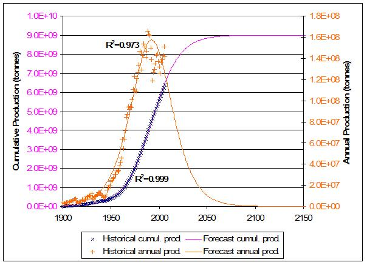

Calculus-Related Modeling Concept Inventory Settings
========================================================

Danny Kaplan, `r date()` for PREP 2012 Workshop


```{r echo=FALSE,warning=FALSE,message=FALSE,results="hide",label="options"}
require(knitr, quietly=TRUE)
opts_chunk$set(fig.width=4,fig.height=4,out.width="3in")
library(mosaic,quietly=TRUE)
trellis.par.set(theme=col.mosaic())
```

## Setting 1

The figure shows precise measurements of the temperature of an storage building over the course of an early spring day.  Sunrise is about 6am, sunset about 6pm (hour 18).

The people using the building are storing temperature-sensitive materials in it.  Certification of the materials requires that the number of degree-hours higher than 60 degrees be kept track of.

```{r label="temperatures",echo=FALSE}
times = c(0,3,6.2,9,12.5,15,17.5,19.5,22,24)
temperatures = c(43,41,42,44,48,56,55,46,39,37)
plotPoints( temperatures~times, pch=20,xlab="Time of Day (hr)",ylab="Temperature (F)",ylim=c(35,60),xlim=c(0,24))
T = splinefun(temperatures~times)
# plotFun(T(t)~t, add=TRUE )
```

### QUESTION
When was the building the warmest and what temperature was it?  Estimate the precision of your answer.  (You can mark your answer on the graph.)

### MISCONCEPTIONS:
* Failing to recognize that there is a continuous process involved and that the maximum is likely to be about hour 16.
* Assuming that the function between the measurements can be just about anything and not making a parabolic estimate.

## Setting 2: The Superslide

You are part of a team assigned to design a "superslide" ride for the state fair.  The design will take the form of a function $h(x)$ where $x$ is the horizontal position, and $h(x)$ is the height of the slide.  Your goal is to give the shape of $h(x)$ that will result in a slide that is as much fun as possible while still safe.

An important part of the analysis is to know how fast the rider is going at each point in the slide, that is, speed$latex (x)$ as a function of position.  A physicist on your team has given you a computer program that will take the shape $latex h(x)$ as an input and give the rider's velocity $latex v(t)$ over time as an output.  

### QUESTION 1:
Explain how you would use the physicist's $latex v(t)$ to find speed$latex (x)$.

### MISCONCEPTIONS
* Not recognizing that the variables $latex t$ and $latex x$ are different.
* Not recognizing that $latex v(t)$ can be integrated to find a position versus time, then that position plugged in to give speed versus time.


Two members of your team have proposed different definitions of instantaneous fun as a function of the rider's speed.  Their graphs are shown below.

```{r label="speed.fun",echo=FALSE,fig.keep="high"}
plotFun(10*s*exp(-.3*s)~s,s.lim=range(0,10),xlab="Speed",ylab="Instantaneous Fun",main="Definition A")
plotFun(3*s^2~s,s.lim=range(0,10),xlab="Speed",ylab="Instantaneous Fun",main="Definition B")
```

### QUESTION 2:
Which of the functions do you prefer for modeling fun?  Explain your preferences, or reasons why you cannot give a preference, in terms of the mathematical features of the functions and your own notions of fun.

### MISCONCEPTIONS
* A subjective notion of fun cannot be modeled mathematically.
* The units make a difference, not just the shape of the function.

A third team member proposes to measure fun by taking people to various straight slides, measuring the rider's speed (at the end of the slide), the slope and length slope of the slide, and then asking the rider to state how much fun they had on a scale of 1 to 100.  There is general enthusiasm for the plan and it is carried out, producing a long data set of which an excerpt is shown below:

<pre>
rider  | speed (m/s) | slope (deg)  | length (m)  |   fun
---------------------------------------------------------------
April  |      5      |    40        |     2       |    34
Bob    |      5.7    |    40        |     2       |    63
April  |      9      |    35        |     3.8     |    58
Bob    |      10.3   |    35        |     3.8     |    87
and so on for many different slides
</pre>

### QUESTION 3 
What explanatory variables would you include in a model of fun based on these data?  Give a sensible form for the model, highlighting which parameters in your model are to be estimated from data.

### MISCONCEPTIONS:
1. Not recognizing that the different riders can have different subjective scales for fun.
2. Not accepting a linear or other low-order polynomial as a reasonable approximation.
3. Interaction term?


## Setting 3: Health, Diet, and Exercise

You are a researcher in a large study of health outcomes.  The participants were students who graduated from high school in 1965.  Over the next 40 years, the participants were tracked in terms of their food intake (measured in average calories per day) and their activity  (measured in average minutes of sitting or lying each day).  Health outcome has been measured using a stress test: the change in blood pressure after a 5 minute walk at 3 mph.

### QUESTION: 
Here are several different possible models of the health outcome.
1  $latex a \times food + a \times activity + b$
2  $latex a \times food + b \times activity + c$
3 $latex a \times food\times activity + b$
4 $latex a \times food + b \times activity + c\times food \times activity + d$
5 $latex a \times food + b \times activity + c\times food^2 + d$
For each model, say what features of the formula will contribute to a good model and what features will interfere with a good model.

### Misconceptions
1. Don't need to have a main effect.
1. Polynomial approximation won't be effective
1. The product or quadratic terms are not necessary.
1. With both variables food and activity in the model, don't need the interaction term.

## Setting 4: Measuring the Volume of a Lake

Your consultant was assigned to estimate the volume of a lake.  The purpose of the measurement is to decide whether the lake volume is lower than 75,000 m^3^, in which case the lake is exempt from zoning regulations.

The consultant was given an accurate measurement of the lake's area from an aerial photograph: 10000 m^2^. To find the depth, she used a computer to select 5 random points on the lake surface and measured the coordinates of each point.  Then, using a rowboat and a Global Position System machine to match the computer-generated locations, she carefully dropped a measuring line to the bottom of the lake in the 5 random points.  Her measurements were 2.3 m, 1.1 m, 8.3 m, 3.5m, 7.0 m. 

The consultant estimated the volume as the mean of the depth measurements times the area of the lake, giving a volume of 44400 m^3^.

### QUESTION: 
At the zoning hearing, you have been asked to judge whether the lake volume is smaller than the zoning regulatory threshold of 75,000 m^2^.  What factors contribute to your judgment?

### MISCONCEPTIONS:
1. Five measurements is not enough
2. Random points are not right.

## Setting 5: Phosphate Production
The graph shows data (the $+$ and $\times$ marks) of annual phosphate production in the US as well as the cumulative amount produced.  The smooth curves show a model fitted to the data.



The model is being used to claim that the historical record shows phosphate production has peaked and is likely to fall to half of the peak value by about year 2025.  

### QUESTION
What features of the data and the model do you find compelling in support of the claim?  

### MISCONCEPTIONS
1. The large $R^2$ values mean something.
2. The normal curve is a good fit to the data.
3. The two models (annual prod. and cumulative) are unrelated.

Source of graph: (http://www.theoildrum.com/node/4624)


